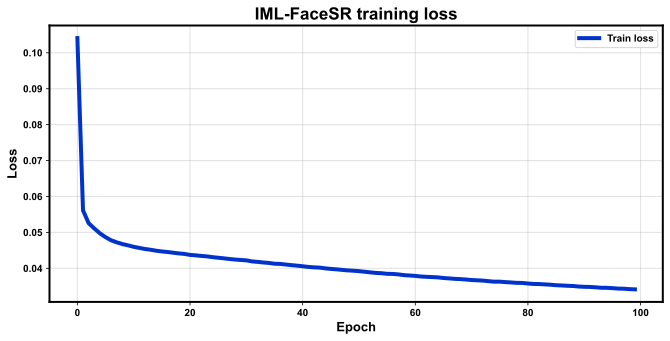
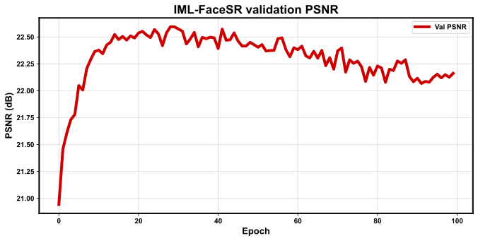

# IML Dual-Branch Face SR — Results Report

Paper: Implicit Mutual Learning With Dual-Branch Networks for Face Super-Resolution (TBIOM 2024).

## Training

| Metric | Value |
|--------|------:|
| Protocol | full |
| Last epoch | 99 |
| Train loss | 0.0342 |
| Val PSNR | 22.162 dB |
| Val SSIM | 0.6893 |
| Params (M) | 2.358864 |

## Test evaluation

| Metric | Value |
|--------|------:|
| Split | test |
| PSNR | 22.874 dB |
| SSIM | 0.6886 |
| N | 60 |

Metrics are from our runs on the paper’s CelebA protocol (real data only).
